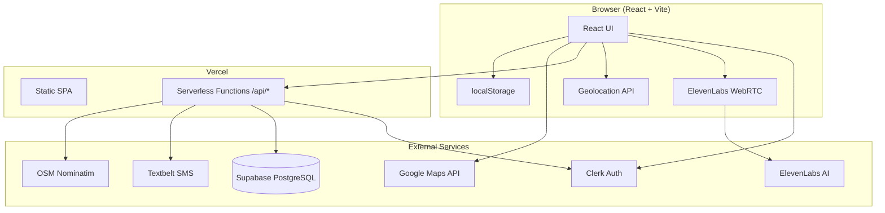

# Patrona — Full Tech Stack

Patrona is a **voice-first personal safety web app** ("walk me home") built as a React SPA with serverless APIs on Vercel, plus several third-party services for auth, voice, SMS, maps, and data.

---

## What It Is

A mobile-friendly PWA-style web app that:

- Talks to you via **ElevenLabs Conversational AI** during a walk
- Monitors silence and safe-word triggers
- Sends **emergency SMS** to contacts with location
- Lets contacts view live location on a public tracking page

---

## Frontend

| Layer | Technology |
|--------|------------|
| **Framework** | React 18 |
| **Language** | JavaScript (JSX) — no TypeScript |
| **Bundler / dev server** | Vite 6 |
| **React plugin** | `@vitejs/plugin-react` |
| **Styling** | Custom CSS design system (`src/index.css`) with CSS variables, dark/light themes, plus inline styles in components |
| **CSS tooling** | Tailwind CSS v4 + `@tailwindcss/vite` (in devDependencies; UI is mostly custom CSS, not utility-class heavy) |
| **Fonts** | Google Fonts — DM Sans, Lora |
| **Module system** | ES modules (`"type": "module"`) |
| **Local state** | React hooks (`useState`, `useEffect`, `useRef`, `useCallback`) |
| **Client storage** | `localStorage` (theme, user profile cache, walk history) |

### Frontend Architecture

```
src/
├── main.jsx          # App entry, ClerkProvider
├── App.jsx           # Auth gate, onboarding, routing by tab/walk state
├── components/       # HomeScreen, WalkScreen, AlertScreen, TrackingPage, etc.
├── hooks/            # useVoiceSession, useGPS, useSafetyMonitor
└── utils/            # alerts, storage, maps, userApi
```

### Browser / Device APIs

- **Microphone** — `navigator.mediaDevices.getUserMedia` (voice session)
- **Geolocation** — `navigator.geolocation.watchPosition` (live GPS during walks)
- **WebRTC** — via `@elevenlabs/client` `Conversation.startSession`
- **Crypto** — `crypto.randomUUID()` for walk session IDs

---

## Backend (Two Implementations)

Patrona has **two backend paths** for the same API surface:

### 1. Production — Vercel Serverless Functions

| Path | Purpose |
|------|---------|
| `api/alert.js` | Emergency SMS alerts |
| `api/alert-clear.js` | "All clear" SMS |
| `api/ping.js` | Store GPS pings |
| `api/location/[sessionId].js` | Fetch latest location for a session |
| `api/user.js` | User profile + emergency contacts CRUD |
| `api/_lib/*` | Shared auth, CORS, validation, SMS, Supabase, rate limiting |

Routing is configured in `vercel.json` (SPA fallback + API rewrites).

### 2. Local Dev — Express Server

| Tech | Details |
|------|---------|
| **Runtime** | Node.js |
| **Framework** | Express 4 |
| **Middleware** | `cors`, `express-rate-limit`, `dotenv` |
| **Port** | 3001 (proxied from Vite on 5173) |

Vite proxies `/api` → `http://localhost:3001` during `npm run dev`.

---

## Third-Party Services & APIs

| Service | Role |
|---------|------|
| **Clerk** | User auth (`@clerk/clerk-react` frontend, `@clerk/backend` JWT verification on API) |
| **ElevenLabs** | Conversational AI voice companion (`@elevenlabs/client`, WebRTC) |
| **Supabase** | PostgreSQL DB via `@supabase/supabase-js` — users, emergency contacts, location pings |
| **Textbelt** | SMS for alerts and all-clear messages |
| **OpenStreetMap Nominatim** | Reverse geocoding (lat/lng → address in SMS) |
| **Google Maps JavaScript API** | Maps, geocoding, walking directions (`places`, `geometry` libraries) |
| **Vercel** | Hosting for frontend + serverless API |

### Notes on Dependencies

- **`twilio`** is listed in `package.json` but **not used anywhere in the codebase** — SMS goes through Textbelt instead.
- **Supabase** uses Row Level Security; location pings are publicly readable for the tracking page.

---

## Database (Supabase / PostgreSQL)

Tables from `supabase-schema.sql`:

| Table | Stores |
|-------|--------|
| `users` | Name, safe word, home address, linked to Clerk ID |
| `emergency_contacts` | Contact name, phone, relationship |
| `location_pings` | Real-time GPS per walk session |

---

## Environment Variables

**Frontend (`VITE_*`):**

- `VITE_ELEVENLABS_AGENT_ID`
- `VITE_GOOGLE_MAPS_API_KEY`
- `VITE_CLERK_PUBLISHABLE_KEY`
- `VITE_API_URL` (optional; empty = same origin)

**Backend:**

- `CLERK_SECRET_KEY`
- `TEXTBELT_KEY`
- `SUPABASE_URL` + `SUPABASE_ANON_KEY` (or `SUPABASE_SERVICE_KEY`)
- `FRONTEND_URL`

---

## Security & Reliability

- Clerk JWT auth on protected API routes
- Rate limiting (Express + in-memory limiter in serverless)
- CORS restrictions
- Security headers (`X-Content-Type-Options`, `X-Frame-Options`, etc.)
- Input validation (phone numbers E.164, coords, trigger types)
- Request body size limits (10 KB)

---

## Deployment & Build

| Command | What it does |
|---------|--------------|
| `npm run dev` | Vite dev server (port 5173) |
| `npm run build` | Production build → `dist/` |
| `npm run preview` | Preview production build |
| `cd server && npm run dev` | Local Express API with `--watch` |

- **Hosting:** Vercel (static frontend + `/api/*` functions)
- **No CI/CD** configs found (no `.github/workflows`)
- **No test framework** in the repo
- **No TypeScript**, **no React Router** (state-based screen switching in `App.jsx`)

---

## High-Level Architecture



---

## Summary

Patrona is a **JavaScript/React + Vite** SPA with **Clerk** auth, **ElevenLabs** voice, **Supabase** persistence, **Textbelt** SMS, **Google Maps** + **OSM** for location, deployed on **Vercel** with **Express** for local API development. It is not a native mobile app — it is a **progressive web app** using browser APIs for mic, GPS, and real-time voice.
