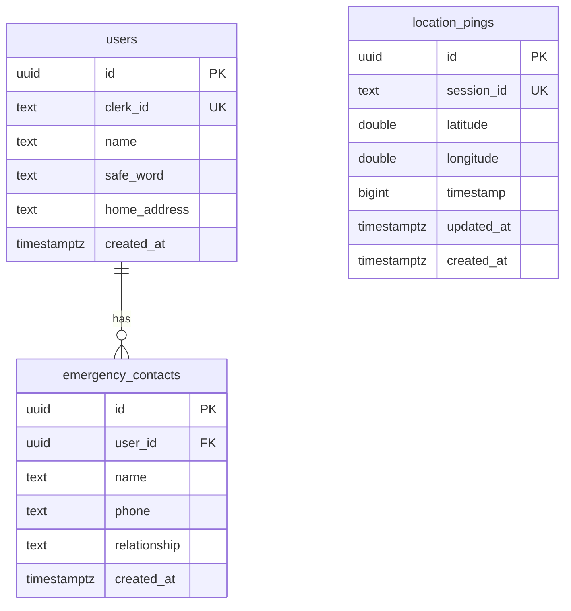

# 05 — Backend Schema · Data Model & Auth Architecture

**Patrona** · How data is stored, structured, and secured.
Version 1.0 · June 2026 · Reflects `supabase-schema.sql` + `api/*`.

---

## Database: Supabase (PostgreSQL)

Three tables. RLS enabled on all. Serverless functions use the Supabase key and are the only writers; the public tracking page reads location pings directly.

### Table: `users`

| Column | Type | Notes |
| :---- | :---- | :---- |
| `id` | `uuid` PK | `default gen_random_uuid()` |
| `clerk_id` | `text` UNIQUE | Links the row to a Clerk user — the join key for all auth |
| `name` | `text` NOT NULL | First name |
| `safe_word` | `text` NOT NULL | The covert distress cue scanned in the transcript |
| `home_address` | `text` | `default ''` |
| `created_at` | `timestamptz` | `default now()` |

### Table: `emergency_contacts`

| Column | Type | Notes |
| :---- | :---- | :---- |
| `id` | `uuid` PK | `default gen_random_uuid()` |
| `user_id` | `uuid` FK → `users.id` | `on delete cascade` |
| `name` | `text` NOT NULL | |
| `phone` | `text` NOT NULL | Validated E.164 at the API layer |
| `relationship` | `text` | Optional (e.g. "roommate") |
| `created_at` | `timestamptz` | `default now()` |

Onboarding allows **1–3** contacts.

### Table: `location_pings`

| Column | Type | Notes |
| :---- | :---- | :---- |
| `id` | `uuid` PK | `default gen_random_uuid()` |
| `session_id` | `text` UNIQUE NOT NULL | One row per walk session (`crypto.randomUUID()` from the client); upserted as the walk progresses |
| `latitude` | `double precision` NOT NULL | |
| `longitude` | `double precision` NOT NULL | |
| `timestamp` | `bigint` NOT NULL | Client epoch ms of the ping |
| `updated_at` | `timestamptz` | `default now()` |
| `created_at` | `timestamptz` | `default now()` |

**Indexes:** `idx_location_pings_session_id` (fast tracking-page lookup), `idx_location_pings_timestamp` (cleanup queries).

## Relationships

```
users (1) ───< (many) emergency_contacts        emergency_contacts.user_id → users.id  (cascade delete)
users  ··· identified by clerk_id (Clerk)        all authed API calls resolve user via clerk_id
location_pings                                    standalone, keyed by session_id (not FK-linked to users)
```

> **Design note:** `location_pings` is intentionally *not* foreign-keyed to a user. It's keyed only by an unguessable `session_id` so the public tracking page can read it without exposing user identity or requiring auth. The session ID is the secret.

## Entity diagram



## Auth model

- **Provider:** Clerk. Frontend uses `@clerk/clerk-react`; the API verifies the Clerk **Bearer JWT** via `@clerk/backend` in `api/_lib/auth.js` (`isAuthorized()`, `getClerkUserId()`).
- **User resolution:** the verified `clerk_id` is matched against `users.clerk_id`. No passwords or session secrets live in our DB.
- **Storage scoping (client):** `localStorage` is scoped per Clerk user ID (`setStorageUserId`) so a shared device doesn't leak profiles.

## Row Level Security (RLS)

RLS is enabled on all three tables. Policies as written in `supabase-schema.sql`:

| Table | Policy | Effect |
| :---- | :---- | :---- |
| `location_pings` | `Allow public read of location pings` (`select using (true)`) | **Anyone can read pings** — required so contacts' tracking page works without auth. Safety relies on the unguessable `session_id`. |
| `users` | `Service role manages users` (`for all using (true)`) | Serverless functions (service key) manage rows; mainly documentation since the service role bypasses RLS. |
| `emergency_contacts` | `Service role manages contacts` (`for all using (true)`) | Same. |
| `location_pings` | `Service role manages pings` (`for all using (true)`) | Same. |

> ⚠️ **Hardening note for App Store / production:** the current policies are permissive (`using (true)`) and rely on the serverless layer being the only writer. Before public launch, tighten so that (a) writes are restricted to the service role only, and (b) the public `select` on `location_pings` is scoped/expiring if feasible (e.g. only recent, active sessions). Authorization is currently enforced primarily at the **API layer** (Clerk JWT + ownership checks), not in the DB — make that explicit and audited.

## API → data mapping

| Endpoint | Reads/Writes | Auth |
| :---- | :---- | :---- |
| `POST /api/user` | upsert `users` (by `clerk_id`) + replace `emergency_contacts` | Clerk JWT |
| `GET /api/user` | read `users` + `emergency_contacts` for the caller | Clerk JWT |
| `POST /api/ping` | upsert `location_pings` by `session_id` | Clerk JWT |
| `GET /api/location/[sessionId]` | read latest `location_pings` row | Public (RLS public read) |
| `POST /api/alert` | reads contacts; reverse-geocodes coords (OSM); sends SMS (Textbelt) | Clerk JWT |
| `POST /api/alert-clear` | sends "all clear" SMS to contacts | Clerk JWT |
| `GET /api/health` | none | Public |

## Validation & limits (`api/_lib/validate.js`)

- Phone numbers normalized/validated to **E.164**.
- Coordinates bounds-checked (valid lat/lng ranges).
- Trigger type constrained to an enum (`VALID_TRIGGER_TYPES` — e.g. safe-word, silence, route-deviation).
- Request body capped at **10 KB**.
- IP-based rate limiting (`api/_lib/rateLimit.js`) — e.g. 5 emergency alerts / 15-min window.

## Sensitive data

- **Phone numbers** (contacts) — stored in `emergency_contacts`. Necessary for SMS; declare in the iOS Privacy Manifest.
- **Location** — `location_pings`, publicly readable by session ID. Transient; should be cleaned up (the timestamp index supports a cleanup job — recommend a scheduled purge of old pings).
- **No payment data** stored (no payments in v1).
- **Auth credentials** never touch our DB (delegated to Clerk).

## File / media storage

None. Patrona stores no files, images, or audio recordings. The voice conversation is **not recorded or persisted** — it streams via ElevenLabs WebRTC and is gone. (This is a privacy strength worth stating in the App Store listing.)

## Recommended migrations before scale (v2)

1. Tighten RLS (service-role-only writes; scoped/expiring public read).
2. Add a `walks`/`sessions` table if walk history needs to be cloud-synced (today history is local-only).
3. Add a scheduled cleanup for stale `location_pings`.
4. Consider linking pings to users via a nullable `user_id` for analytics (kept out of the public read path).

---

*Related: [TRD](02_TRD.md) · [App Flow](03_App_Flow.md) · [Implementation Plan](06_Implementation_Plan.md) · source: `supabase-schema.sql`, `api/_lib/*`*
